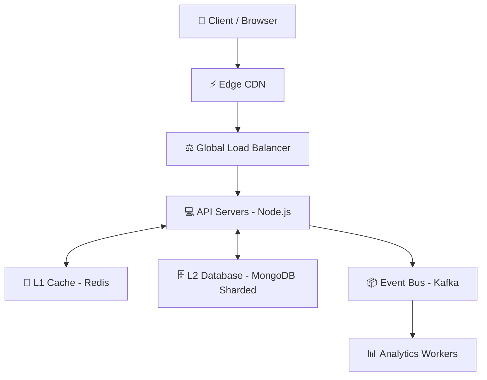

# 🌍 FAANG-Scale URL Shortener Service

Welcome to the **System Design Masterclass** via code. This project is not just a URL shortener; it is an exploration into building **highly available, horizontally scalable, and low-latency systems**.

---

## 🏗️ High-Level Architecture (The Big Picture)

At FAANG scale, we shift from "how to build a feature" to "how to handle 100M+ users".



---

## ⚡ Core Design Patterns Implemented

### 1. Distributed ID Generation (Snowflake Pattern)
Traditional DB Auto-Increments fail at scale because they create a single point of failure and bottleneck.
- **Solution**: We use **Snowflake IDs** (64-bit integers).
- **Structure**: `| Timestamp | Machine ID | Sequence |`
- **Result**: Unique, collision-free IDs across multiple server regions without talking to a central database.

### 2. URL Encoding (Base62)
To convert a massive numeric ID (like `81273912312`) into a tiny short URL code (like `aZx91K`).
- **Base62**: Uses `0-9`, `a-z`, `A-Z`.
- **Reason**: URL friendly characters that minimize code length while maximizing capacity.

### 3. Multi-Layer Caching (L1/L2)
Redirects must be under **50ms**.
- **L1 (Redis)**: Stores the `shortCode -> longURL` mapping with an expiry. Hits are ultrafast.
- **L2 (MongoDB)**: The source of truth. Handles misses and populates the cache.

### 4. Service Layer Pattern
Separating business logic from HTTP requests ensures the system is easy to test and maintain.

---

## 📈 Capacity Estimation (The Interviewer's Favorite)

Assume you are at **FAANG scale**:
- **Writes/day**: 10 million (New short links)
- **Reads/day**: 500 million (Redirections)
- **Storage**: ~300 bytes per record (URL + Metadata)
- **Calculation**: 
  - 10M * 300 bytes = **3GB per day**
  - **~1TB per year**
- **Strategy**: Horizontal Sharding by `shortCode` or `machine_id` is required to manage this growth.

---

## 🔥 Solving Advanced Scaling Problems

### 1. The "Hot Key" Problem
*Scenario*: A tweet with your short link goes viral (millions/sec). A single Redis node hosting that key will crash.
- **Solution**: **CDN Caching**. Redirect at the edge (Cloudflare/Fastly) before the request even hits your server.

### 2. Cache Stampede (Dog-piling)
*Scenario*: Cache for a popular link expires. 10,000 requests hit the database simultaneously.
- **Solution**: **Request Coalescing** or **Distributed Locking**. We ensure only one "worker" fetches from the DB while others wait.

### 3. Analytics Pipeline (Event-Driven)
Do NOT increment hit counts inside the redirect request. It slows down the user.
- **Solution**: Push "Click Events" to **Kafka/Redpanda**. Background workers process this asynchronously to update dashboards.

---

## 🚀 How to Run Locally

1. **Prerequisites**: [MongoDB](https://www.mongodb.com/try/download/community) and [Redis](https://redis.io/download/).
2. **Install Dependencies**:
   ```bash
   npm install
   ```
3. **Configure Environment**: Update `.env` with your Mongo/Redis URIs.
4. **Launch Dev Server**:
   ```bash
   npm run dev
   ```

---

## 🛡️ Roadmap to "Distinguished Engineer"

- [ ] **Rate Limiting**: Implementation using Token Bucket algorithm in Redis.
- [ ] **Custom Aliases**: Allow users to pick `url.com/xyz`.
- [ ] **TTL/Expiry**: Automatic cleanup of old links using MongoDB TTL indexes.
- [ ] **Micro-Service Migration**: Move ID generator to a standalone gRPC service.

Designed with ❤️ for High-Scale Engineering.
