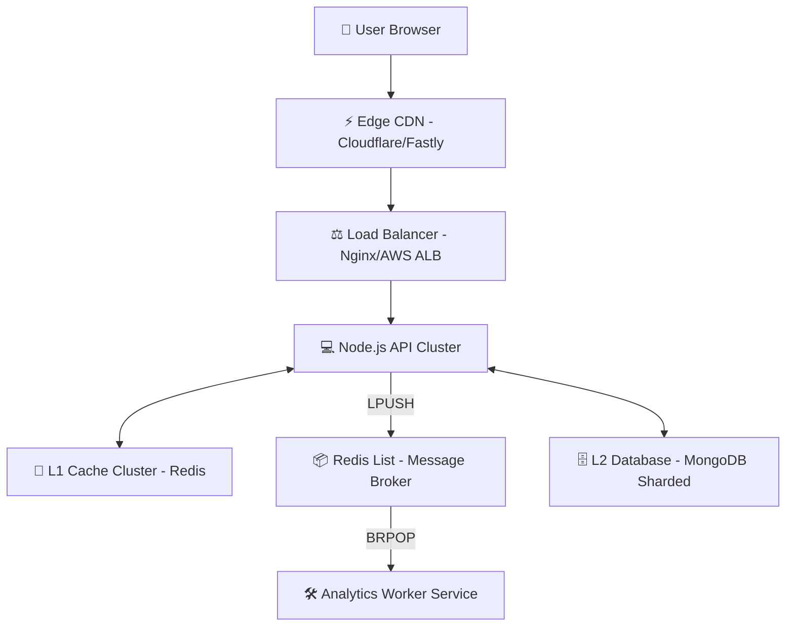

# 🌍 Scalable URL Shortener - System Design Masterclass

This project is a hands-on implementation of a **highly available, horizontally scalable, and low-latency** URL Shortener Service. It follows core distributed systems patterns to handle massive traffic spikes.

---

## 🏗️ High-Level Architecture (The Big Picture)

To handle 100M+ users, the system is designed to be **decoupled** and **event-driven**.

---

## ⚡ Core Scaling Strategies Implemented

### 1. Distributed ID Generation (The Snowflake Problem)
Traditional DB auto-incrementing IDs create a central bottleneck.
- **Solution**: **Snowflake IDs**.
- **Logic**: Each server generates its own unique 64-bit ID using machine ID + timestamp + sequence.
- **Benefit**: Zero coordination needed between servers.

### 2. Solving the "Hot Key" Problem (CDN Caching)
*Scenario*: A viral link gets 1M clicks/sec. Even Redis might struggle.
- **Solution**: **Edge Redirect**. 
- **Implementation**: We send `Cache-Control: public, max-age=300` headers.
- **Result**: The first request hits our API, but subsequent hits for the next 5 mins are handled by the CDN (Cloudflare/Fastly) directly, never touching our servers.

### 3. Async Analytics (Redis Message Broker Pattern)
*Scenario*: We want to track click analytics (IP, device, time) without slowing down the user redirect.
- **Implementation**: **Redis List as a Queue**.
- **Producer**: The API server uses `LPUSH` to dump click metadata into a Redis list called `analytics_queue`.
- **Broker**: Redis holds this data persistently in memory. 
- **Consumer**: A separate **Worker Process** uses `BRPOP` (Blocking Right Pop) to listen for new events and process them in the background.

### 4. Storage Optimization & Sharding
*Scenario*: 100 Billion URLs cannot fit on one machine's disk or memory.
- **TTL Index (Link Expiration)**: We implemented a **TTL Index** on `createdAt`. Links automatically delete themselves after 365 days to free up space.
- **Logical Sharding Logic**: Implemented `src/utils/shardRouter.js`. This logic uses a hash of the `shortCode` to determine which DB node (Shard) should handle the request. This allows us to scale storage infinitely by adding more DB machines.

### 5. Rate Limiting (Resource Protection)
*Scenario*: A malicious bot tries to create millions of URLs in seconds to fill up your database.
- **Solution**: **Redis-backed Rate Limiter**.
- **Logic**: Uses a **Fixed Window Counter** pattern. It tracks the number of requests per IP in Redis.
- **Implementation**: Currently set to **5 requests per minute** for the `/shorten` endpoint (for local testing).

---

## 🏗️ Horizontal Scaling Concepts

### Load Balancing & Statelessness
Our API servers are **stateless**. This means they don't store "session" info. Any user can hit any of our 100 API servers and get the same result. A **Load Balancer** (like Nginx) sits in front to distribute traffic.

### Database Sharding (L2 Storage)
If one MongoDB instance fills up, we **Shard** the data based on the `shortCode`.
- **Shard A**: Links starting with `0-Z`
- **Shard B**: Links starting with `a-z`
This allows us to scale storage infinitely by adding more DB nodes.

---

## 📂 Project Structure (LLD)

| Component | Responsibility | Analogous To... |
| :--- | :--- | :--- |
| **Routes** | Defines the API endpoints. | The Map |
| **Controllers** | Handles HTTP headers, status codes, and input validation. | The Receptionist |
| **Services** | Core logic: ID generation, Caching checks, and Queue pushing. | The Brain/Manager |
| **Middlewares** | Security and protection layers (e.g., **Rate Limiter**). | The Security Guard |
| **Workers** | Background tasks (Processing analytics events from Redis). | The Cleaning Crew |
| **Utils/Logic** | Base62 encoding, Snowflake IDs, and **Shard Routing**. | The Toolbox |

---

## 🚀 How to Run Locally

1.  **Start Infrastructure**: `docker-compose up -d`.
2.  **Start the API Server**: `npm run dev`.
3.  **Start the Analytics Worker**: `npm run worker`.

### 🧪 Practical Verification
1.  **Rate Limit Test**: Try to shorten a URL more than 5 times in 1 minute.
2.  **Redirect Test**: Access a short URL. Your browser redirects instantly.
3.  **TTL Verification**: Check MongoDB `URL` collection; it now has a `createdAt` index with an `expireAfterSeconds` set.

---

### 📝 Notebook Study Points
- Draw the flow of a single click from the **User** to the **Worker**.
- Why is `BRPOP` better than a `while(true)` loop with a delay? (Hint: Efficient CPU usage).
- Explain how `LPUSH` ensures no data is lost even if the API server crashes after pushing.
- **Sharding Question**: Why do we hash the `shortCode` for sharding instead of using the `longUrl`?

---

Designed for **High-Performance Architecture Training**.
